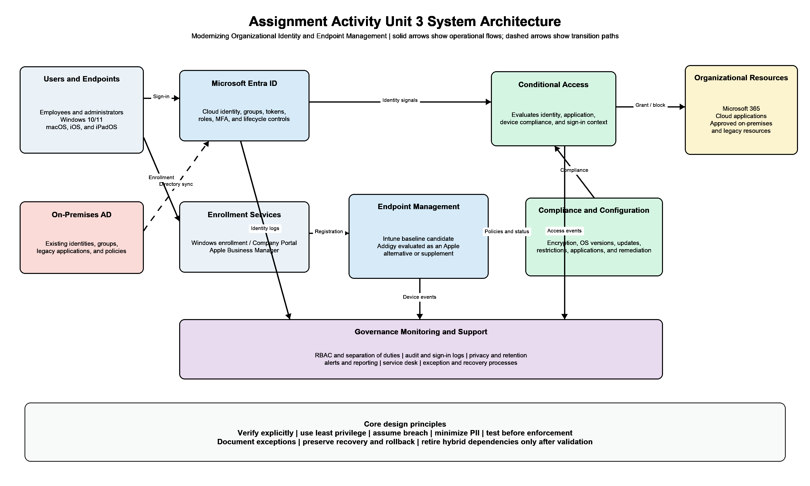

# Modernizing Organizational Identity and Endpoint Management

This repository supports an MSIT capstone project that evaluates how an organization can move from traditional on-premises Microsoft Active Directory toward cloud-based identity and endpoint management while continuing to support Windows, macOS, iOS, and iPadOS devices.

The proposed design uses Microsoft Entra ID and Microsoft Intune as baseline candidates. Apple Business Manager provides organizational Apple enrollment, while Addigy is evaluated as an Apple-focused alternative or supplement. The final recommendation will be based on the same documented requirements, test evidence, security and privacy considerations, operational effort, and cost for each option.

## Research gap and design response

Existing sources provide useful but separate guidance. NIST and CISA describe identity assurance, privacy, and zero-trust outcomes, while Microsoft, Apple, and Addigy document platform capabilities. Standards do not prescribe a complete mixed-platform migration, and vendor documentation does not independently compare the products in this organization.

The proposed system addresses that gap by connecting identity lifecycle, authentication, endpoint enrollment, configuration, compliance, Conditional Access, monitoring, privacy, and legacy transition controls. Standards define the expected security and privacy outcomes. Vendor material identifies capabilities that still require requirements-based review or proof-of-concept testing. See [Research Analysis and Design Response](docs/research-analysis.md) for the detailed connection.

## Project objectives

- Document identity, endpoint, security, privacy, compatibility, support, and cost requirements.
- Define the proposed architecture and the interactions among its components.
- Compare Intune and Addigy against the same Apple-management outcomes.
- Test representative authentication, enrollment, configuration, compliance, and access scenarios.
- Produce a migration roadmap with dependencies, risks, rollback steps, and hybrid exit criteria.

## Repository structure

| Folder | Purpose |
|---|---|
| `src/` | Safe proof-of-concept procedures, scripts, and sanitized configuration examples. |
| `docs/` | Requirements, module specifications, design decisions, risks, test plans, and progress records. |
| `design/` | Editable Draw.io architecture source and exported preview image. |
| `evidence/` | Anonymized evidence index and guidance for approved screenshots or exports. |

The formal Word assignment documents are submitted separately through the course assignment area and are excluded from this repository.

## Architecture

The design connects cloud identity, endpoint enrollment, configuration and compliance, Conditional Access, organizational resources, monitoring, privacy, support, recovery, and a controlled temporary path for legacy dependencies.

## Branches

- `main` contains reviewed milestone work.
- `development` contains changes being prepared for review.
- Larger changes may use focused branches created from `development`.

See [Version Control and Traceability](docs/version-control-overview.md) for the working approach.

## Current status

The problem definition, critical literature analysis, architecture, module design, functional and nonfunctional requirements, risk review, and version-control structure are complete. The Unit 4 local browser prototype now demonstrates identity access decisions, endpoint compliance evaluation, and session-only decision logging with sample data. Authorized tenant configuration and vendor-specific testing remain future milestones, and vendor documentation will be distinguished from functions observed directly during testing.

## Security and privacy

Do not commit credentials, access tokens, private keys, production exports, personal information, device serial numbers, tenant identifiers, IP addresses, or unredacted screenshots. Use test accounts, nonproduction data, and sanitized evidence.

## Author

Dennis Morales  
MSIT 5910-01 Capstone Project  
University of the People
