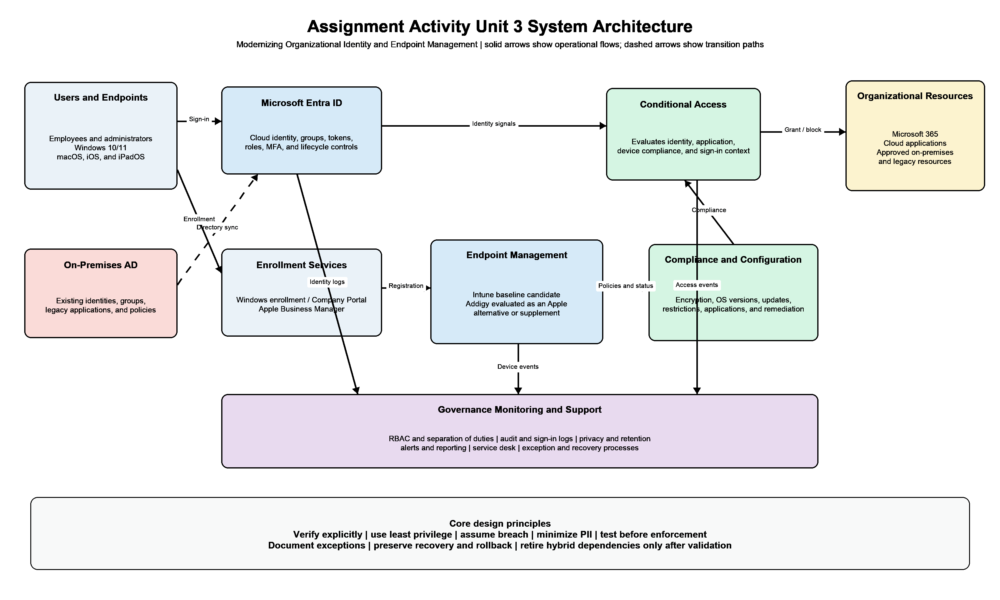

# Modernizing Organizational Identity and Endpoint Management

This repository supports an MSIT capstone project that evaluates how an organization can move from traditional on-premises Microsoft Active Directory toward cloud-based identity and endpoint management while continuing to support Windows, macOS, iOS, and iPadOS devices.

The current baseline uses Microsoft Entra ID for identity and access and Microsoft Intune for Windows, macOS, iOS, and iPadOS management. Apple Business Manager provides organizational assignment, automated enrollment, and application licensing for company-owned Apple devices. Addigy was reviewed as an Apple-focused option, but it is not required in the current baseline. I will reconsider it only if later authorized testing identifies an Apple requirement that Intune cannot meet at an acceptable operational or licensing cost.

## Research gap and design response

Existing sources provide useful but separate guidance. NIST and CISA describe identity assurance, privacy, and zero-trust outcomes, while Microsoft, Apple, and Addigy document platform capabilities. Standards do not prescribe a complete mixed-platform migration, and vendor documentation does not independently compare the products in this organization.

The proposed system addresses that gap by connecting identity lifecycle, authentication, endpoint enrollment, configuration, compliance, Conditional Access, monitoring, privacy, and legacy transition controls. Standards define the expected security and privacy outcomes. Vendor material identifies capabilities that still require requirements-based review or proof-of-concept testing. See [Research Analysis and Design Response](docs/research-analysis.md) for the detailed connection.

## Project objectives

- Document identity, endpoint, security, privacy, compatibility, support, and cost requirements.
- Define the proposed architecture and the interactions among its components.
- Verify the required Apple-management outcomes through Intune and Apple Business Manager and document any remaining gaps.
- Test representative authentication, enrollment, configuration, compliance, and access scenarios.
- Produce a migration roadmap with dependencies, risks, rollback steps, and hybrid exit criteria.

## Repository structure

| Folder | Purpose |
|---|---|
| `src/` | Safe proof-of-concept procedures, scripts, and sanitized configuration examples. |
| `docs/` | Requirements, module specifications, design decisions, risks, test plans, and progress records. |
| `design/` | Editable Draw.io architecture source and exported preview image. |
| `evidence/` | Anonymized evidence index and guidance for approved screenshots or exports. |

The formal Word assignment documents are submitted separately through the course assignment area and are excluded from this repository.

## Architecture

The design connects cloud identity, endpoint enrollment, configuration and compliance, Conditional Access, organizational resources, monitoring, privacy, support, recovery, and a controlled temporary path for legacy dependencies.

## Branches

- `main` contains reviewed milestone work.
- `development` contains changes being prepared for review.
- Larger changes may use focused branches created from `development`.

See [Version Control and Traceability](docs/version-control-overview.md) for the working approach.

## Current status

The problem definition, literature analysis, architecture, module design, requirements, risk review, and version-control structure are complete. The Unit 4 browser prototype demonstrates identity access decisions, endpoint compliance evaluation, and session-only decision logging with sample data. Unit 5 separates the rules into testable functions and adds 16 automated tests with coverage reporting. The working platform baseline is now Entra ID, Intune, and Apple Business Manager. Authorized tenant configuration and vendor-specific testing remain later milestones, and the project will continue to distinguish documented capabilities from behavior observed directly during testing.

## Security and privacy

Do not commit credentials, access tokens, private keys, production exports, personal information, device serial numbers, tenant identifiers, IP addresses, or unredacted screenshots. Use test accounts, nonproduction data, and sanitized evidence.

## Author

Dennis Morales  
MSIT 5910-01 Capstone Project  
University of the People
